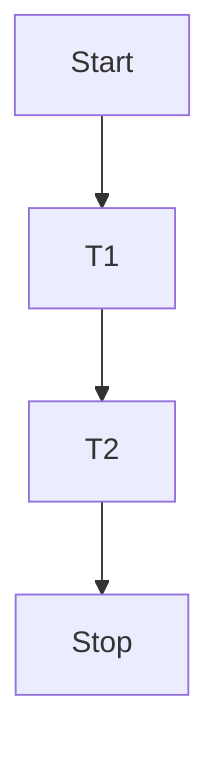
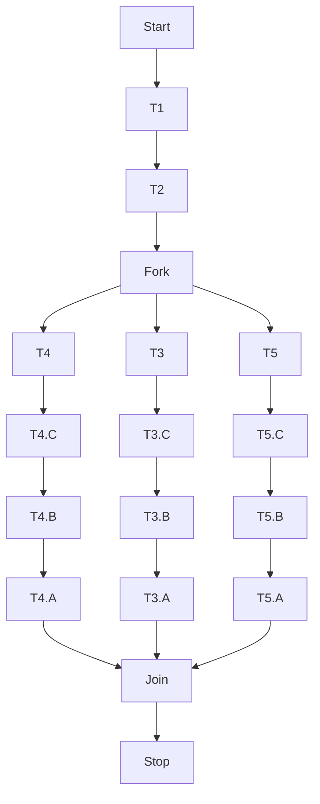

# ANTLR based custom DSL for processing logical expressions as Rules

## Problem Statement 
Imagine you have a task execution framework. It could be your multithreaded application where you submit the tasks to be 
executed or can be as complex as a customised application for executing tasks using AWS Step functions.

The task execution can happen in serial order or there could be multiple branches of execution being ran through a 
fork/join framework.




Now, we have a requirement. We don't need to execute a task and rather mark it as fulfilled in case some other task or 
a combination of the task is already complete or fulfilled. The requirements can be expressed as an expression.

For e.g. **TASK T4.A IS FULFILLED BY TASK T3.C** and in such a case we don't need to executed the task T7 and rather mark it
as fulfilled.

Here the expression can be taken as the basis of our rule, where a task can be fulfilled by 

1. a Task
```text
TASK T7
    IS FULFILLED BY
        TASK T4.A
```
2. an algebraic expression involving multiple tasks as operands and keywords like '**AND**', '**OR**' as logical operators
```text
TASK T7
    IS FULFILLED BY
        TASK T4.A OR TASK T5.A
```
3. grouping of such multiple expressions is also possible through the use of parenthesis.
```text
TASK T7
    IS FULFILLED BY
        (TASK T4.A OR (TASK T5.A OR TASK T4.A) OR (TASK T2 AND TASK T4)) OR TASK T50.1
```
4. a range of tasks could also be fulfilled
```text
ANY TASK FROM TASK T300 TO TASK T300.A
    IS FULFILLED BY
        (TASK T4.A OR (TASK T5.A OR TASK T4.A) OR (TASK T2 AND TASK T4)) OR TASK T50.1
```
These set of rules can be termed as fulfilment rules and needs to be run before executing a test to check whether the
actual task execution is required or not.

Since there can be such multiple flows and hence the rules could be grouped together to indicate a sub-context for a 
particular flow.

```text
definition:flowdefn
definition_id:xyz123
rules:
    ANY TASK FROM TASK T300 TO TASK T300.A
        IS FULFILLED BY
            (TASK T4.A OR (TASK T5.A OR TASK T4.A) OR (TASK T2 AND TASK T4)) OR TASK T50.1
    ANY TASK FROM TASK T3 TO TASK T3.A
        IS FULFILLED BY
            (TASK T4.A AND TASK T5.A) AND TASK T50.1
    TASK T1
        IS FULFILLED BY
            TASK T2.A OR TASK T9.A
    TASK T6
        IS FULFILLED BY
            TASK T4.A OR TASK T5.A
    TASK T7
        IS FULFILLED BY
            TASK T4.A
    TASK T10
        IS FULFILLED BY
            TASK T11.A AND TASK T12.A
```
## Solution:

### Grammar for rule evaluation and fulfilment (Single Rule)

Let's create a DSL for our rules using ANTLR

This will help us evaluate a single rule from a series of rule definitions. The grammar is written in file [EvaluateRule](grammar/EvaluateRule.g4).g4

```antlrv4-tool
grammar EvaluateRule;

expr                    : expr (AND|OR) expr
                        | '(' expr ')'
                        | key_value_rule
                        ;

key_value_rule          : TASK_TOKEN TEXT;

DEFAULT                 : 'default';
ANY                     : 'ANY ';
TASK_TOKEN              : 'TASK ';
FROM                    : 'FROM ';
TO                      : ' TO ';
IS                      : 'IS ';
OR                      : ' OR ';
AND                     : ' AND ';
FULFILLED               : 'FULFILLED ';
BY                      : 'BY';
TEXT                    : [a-zA-Z0-9./]+;
WS                      : [ \t\n]+ -> skip ; // toss out whitespace
```

While a complete definition would look like, which is written in file [FulfillRule.g4](grammar/FulfillRule.g4). 

### Complete grammar for listing all rules together (Multiple Rules)

```antlrv4-tool
grammar FulfillRule;

file                    : definition definition_id logical_rules EOF;

definition              : DEFINITION_TOKEN ':' TEXT;

definition_id           : DEFINITION_ID_TOKEN ':' (TEXT|DEFAULT);

logical_rules           : 'rules:' (logical_rule)+;

logical_rule            : source_rule  IS FULFILLED BY expr;

source_rule             : (ANY TASK_TOKEN FROM key_value_rule TO key_value_rule | key_value_rule);

expr                    : expr (AND|OR) expr
                        | '(' expr ')'
                        | key_value_rule
                        ;

key_value_rule          : TASK_TOKEN TEXT;

DEFINITION_TOKEN        : 'definition';
DEFINITION_ID_TOKEN     : 'definition_id';
DEFAULT                 : 'default';
ANY                     : 'ANY ';
TASK_TOKEN              : 'TASK ';
FROM                    : 'FROM ';
TO                      : ' TO ';
IS                      : 'IS ';
OR                      : ' OR ';
AND                     : ' AND ';
FULFILLED               : 'FULFILLED ';
BY                      : 'BY';
TEXT                    : [a-zA-Z0-9./]+;
WS                      : [ \t\n]+ -> skip ; // toss out whitespace
```

### Generating the code for ANTLR grammar.

Refer https://www.antlr.org/tools.html for tools through which the complete source code for lexer, parser, tokeniser and 
subsequently the visitors could be generated. .

In this repository the source code is generated for target language as Javascript and is available in "src" directory. 

### Changes in the visitor to evaluate the Task state

#### EvaluateRuleVisitor.js
The visitExpr(ctx) method in the visitor hierarchy needs to be customised to take care of our operands and operators.
Here, you can see that the expressions declared in the rules are being evaluated on the basis of the keywords.

```javascript
// Visit a parse tree produced by EvaluateRuleParser#expr.
visitExpr(ctx)
{
    let logical_operator = undefined;

    if (ctx.AND && ctx.AND()) {
        logical_operator = ' ' + ctx.AND.name + ' '
    } else if (ctx.OR && ctx.OR()) {
        logical_operator = ' ' + ctx.OR.name + ' '
    }

    let expression_value = null;
    if (logical_operator) {
        let operand_A = this.visitExpr(ctx.expr()[0]);
        let operand_B = this.visitExpr(ctx.expr()[1]);
        if (ctx.AND && ctx.AND()) {
            expression_value = operand_A && operand_B;
        } else if (ctx.OR && ctx.OR()) {
            expression_value = operand_A || operand_B;
        }
    } else {
        expression_value = this.visitChildren(ctx).filter(element => {
            return element !== undefined;
        })
        expression_value = R.head(R.flatten(expression_value))
    }
    this._expression_value = expression_value;
    return expression_value;
}
```

Similarly the visitKey_value_rule needs to be customised. Since, it could be considered as the leaf of the expression
tree, we could simply load its value from some external source. For e.g. in a real world application it could come from
a database table, which contains the records of task execution.

```javascript
visitKey_value_rule(ctx) 
{
    let task_token = '' + ctx.TEXT()
    return this._taskEvaluator.evaluate(task_token);
}
```
For the sake of resolving tasks and illustrating the same I have mocked the values for these tasks in the following file.
[taskRangeProvider.js](src/provider/taskRangeProvider.js)

### Testing the code

#### Running single rule file

[app-evalulator.js](src/app-evalulator.js) has the following code through which a single rule could be evaluated.

```javascript
import * as fs from 'fs';
import * as path from 'path';

import * as antlr4 from 'antlr4';
import EvaluateRuleLexer from "./grammar/evaluateRule/EvaluateRuleLexer.js";
import EvaluateRuleParser from "./grammar/evaluateRule/EvaluateRuleParser.js";
import EvaluateRuleListener from "./grammar/evaluateRule/EvaluateRuleListener.js";

function readFile() {
    const content = fs.readFileSync(path.join(path.resolve(), '../sample/evaluateRule/single-rule-1.txt'), {
        encoding: 'utf-8',
    },);

    let inputStream = antlr4.default.CharStreams.fromString(content);
    let lexer = new EvaluateRuleLexer(inputStream)

    let tokens = new antlr4.default.CommonTokenStream(lexer);
    let parser = new EvaluateRuleParser(tokens);

    let listener = new EvaluateRuleListener();
    let tree = parser.expr()
    antlr4.default.tree.ParseTreeWalker.DEFAULT.walk(listener, tree)
    let expression_result = listener.visitor.expression_value;
    console.log("Expression Result " + expression_result)

}

readFile();

```

Here, one could alter the values for tasks in the taskRangeProvider.js file in evaluation_table and could see the result

#### Running multiple rule file
In case, you are looking for how the heirarchy of expressions are evaluated then run [app-execution.js](src/app-execution.js)

```text
Definition flowdefn
Definition-Id xyz123
logical rule statement [object Object]
expression-value ["TASK  T4.A"]
expression-value ["TASK  T5.A"]
expression-value ["TASK  T4.A"]
expression-value ["(TASK  T5.A OR TASK  T4.A)"]
expression-value ["TASK  T2"]
expression-value ["TASK  T4"]
expression-value ["(TASK  T2 AND TASK  T4)"]
expression-value ["((TASK  T4.A OR (TASK  T5.A OR TASK  T4.A)) OR (TASK  T2 AND TASK  T4))"]
expression-value ["TASK  T50.1"]
logical rule statement [object Object]
expression-value ["TASK  T4.A"]
expression-value ["TASK  T5.A"]
expression-value ["(TASK  T4.A AND TASK  T5.A)"]
expression-value ["TASK  T50.1"]
Single task -- 
logical rule statement [object Object]
expression-value ["TASK  T2.A"]
expression-value ["TASK  T9.A"]
Single task -- 
logical rule statement [object Object]
expression-value ["TASK  T4.A"]
expression-value ["TASK  T5.A"]
Single task -- 
logical rule statement [object Object]
expression-value ["TASK  T4.A"]
Single task -- 
logical rule statement [object Object]
expression-value ["TASK  T11.A"]
expression-value ["TASK  T12.A"]
[
  undefined,
  {
    tasks: [ 'T300', 'T300.C', 'T300.B', 'T300.A' ],
    expression: '(((TASK  T4.A OR (TASK  T5.A OR TASK  T4.A)) OR (TASK  T2 AND TASK  T4)) OR TASK  T50.1)'
  },
  {
    tasks: [ 'T3', 'T3.C', 'T3.B', 'T3.A' ],
    expression: '((TASK  T4.A AND TASK  T5.A) AND TASK  T50.1)'
  },
  { tasks: [ 'T1' ], expression: '(TASK  T2.A OR TASK  T9.A)' },
  { tasks: [ 'T6' ], expression: '(TASK  T4.A OR TASK  T5.A)' },
  { tasks: [ 'T7' ], expression: [ 'TASK  T4.A' ] },
  { tasks: [ 'T10' ], expression: '(TASK  T11.A AND TASK  T12.A)' }
]
Logical Rule table --- 

{"T300":"(((TASK  T4.A OR (TASK  T5.A OR TASK  T4.A)) OR (TASK  T2 AND TASK  T4)) OR TASK  T50.1)","T300.C":"(((TASK  T4.A OR (TASK  T5.A OR TASK  T4.A)) OR (TASK  T2 AND TASK  T4)) OR TASK  T50.1)","T300.B":"(((TASK  T4.A OR (TASK  T5.A OR TASK  T4.A)) OR (TASK  T2 AND TASK  T4)) OR TASK  T50.1)","T300.A":"(((TASK  T4.A OR (TASK  T5.A OR TASK  T4.A)) OR (TASK  T2 AND TASK  T4)) OR TASK  T50.1)","T3":"((TASK  T4.A AND TASK  T5.A) AND TASK  T50.1)","T3.C":"((TASK  T4.A AND TASK  T5.A) AND TASK  T50.1)","T3.B":"((TASK  T4.A AND TASK  T5.A) AND TASK  T50.1)","T3.A":"((TASK  T4.A AND TASK  T5.A) AND TASK  T50.1)","T1":"(TASK  T2.A OR TASK  T9.A)","T6":"(TASK  T4.A OR TASK  T5.A)","T7":"TASK  T4.A","T10":"(TASK  T11.A AND TASK  T12.A)"}

```

Author: Hussain Pithawala
